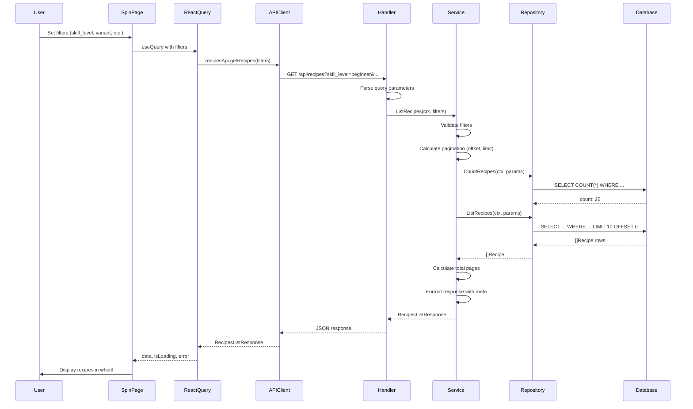
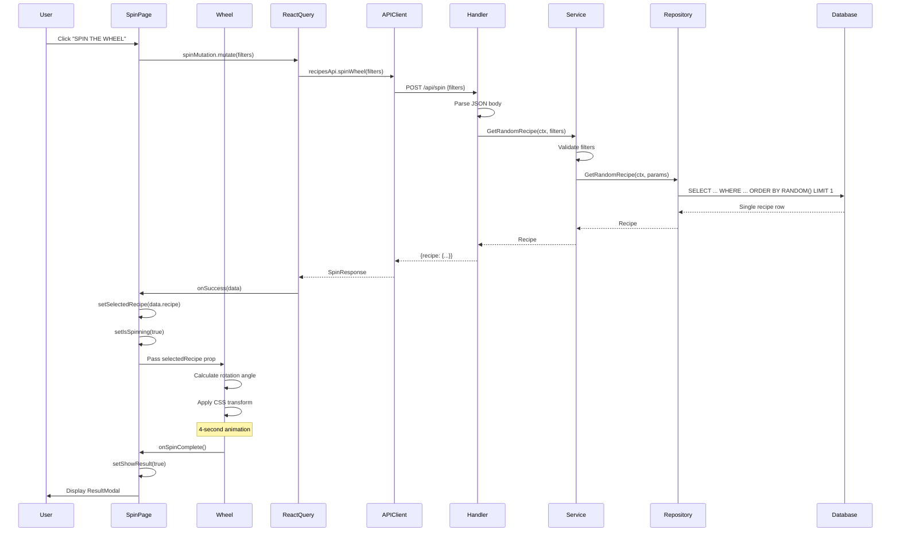

# Data Flow Documentation

This document explains the complete data flow through the MasakYuk application for both the recipe listing and spin wheel features.

## 1. Recipe Listing Flow (GET /api/recipes)

### Frontend → Backend



### Detailed Steps

#### 1.1 Frontend Request Construction
**File**: `frontend/src/api/recipes.ts`

```typescript
const params = new URLSearchParams();
if (filters.search) params.append('search', filters.search);
if (filters.skill_level) params.append('skill_level', filters.skill_level);
// ... other filters
```

**Result**: `GET /api/recipes?search=nasi&skill_level=beginner&page=1&per_page=10`

#### 1.2 Handler - Query Parameter Parsing
**File**: `backend/internal/handler/recipes_handler.go`

```go
filters := service.RecipeFilters{Page: 1, PerPage: 10}

if search := c.Query("search"); search != "" {
    filters.Search = &search
}
if skillLevel := c.Query("skill_level"); skillLevel != "" {
    filters.SkillLevel = &skillLevel
}
// Parse other parameters...
```

**Validation**:
- Page must be ≥ 1
- PerPage must be 1-100
- Numeric fields validated with `strconv.ParseInt`

#### 1.3 Service - Business Logic
**File**: `backend/internal/service/recipes_service.go`

**Validation**:
```go
if filters.SkillLevel != nil && !isValidSkillLevel(*filters.SkillLevel) {
    return nil, fmt.Errorf("%w: invalid skill_level", ErrInvalidParams)
}
```

**Pagination Calculation**:
```go
offset := int32((filters.Page - 1) * filters.PerPage)  // Page 3, PerPage 10 → offset 20
limit := int32(filters.PerPage)                         // limit 10
```

**Two Database Calls**:
1. `CountRecipes()` - Get total matching records
2. `ListRecipes()` - Get paginated results

**Meta Calculation**:
```go
totalPages := int(count) / filters.PerPage
if int(count)%filters.PerPage > 0 {
    totalPages++
}
```

#### 1.4 Repository - Data Access
**File**: `backend/internal/repository/recipes_repository.go`

Wraps sqlc-generated queries:
```go
return r.queries.ListRecipes(ctx, db.ListRecipesParams{
    Search:         params.Search,
    SkillLevel:     params.SkillLevel,
    VariantID:      params.VariantID,
    CategoryID:     params.CategoryID,
    MaxCookingTime: params.MaxCookingTime,
    Limit:          params.Limit,
    Offset:         params.Offset,
})
```

#### 1.5 Database - SQL Query
**File**: `backend/db/queries/query.sql`

```sql
SELECT 
    r.id, r.title, r.description, r.ingredients, r.instructions,
    r.cooking_time, r.skill_level, r.category_id, c.name as category_name,
    r.variant_id, v.name as variant_name, r.image_url, r.servings,
    r.created_at, r.updated_at
FROM recipes r
INNER JOIN categories c ON r.category_id = c.id
INNER JOIN variants v ON r.variant_id = v.id
WHERE 
    (sqlc.narg('search')::text IS NULL OR r.title ILIKE '%' || sqlc.narg('search')::text || '%')
    AND (sqlc.narg('skill_level')::text IS NULL OR r.skill_level = sqlc.narg('skill_level')::text)
    AND (sqlc.narg('variant_id')::integer IS NULL OR r.variant_id = sqlc.narg('variant_id')::integer)
    AND (sqlc.narg('category_id')::integer IS NULL OR r.category_id = sqlc.narg('category_id')::integer)
    AND (sqlc.narg('max_cooking_time')::integer IS NULL OR r.cooking_time <= sqlc.narg('max_cooking_time')::integer)
ORDER BY r.created_at DESC
LIMIT $1 OFFSET $2;
```

**Efficiency Notes**:
- Uses indexes on `skill_level`, `category_id`, `variant_id`, `cooking_time`
- INNER JOINs are efficient (foreign keys indexed)
- NULL checks allow optional filters
- ILIKE for case-insensitive search

#### 1.6 Response Format
```json
{
  "data": [
    {
      "id": 1,
      "title": "Nasi Goreng",
      "cooking_time": 20,
      "skill_level": "beginner",
      "category_name": "Indonesian",
      "variant_name": "Regular",
      ...
    }
  ],
  "meta": {
    "total": 25,
    "page": 1,
    "per_page": 10,
    "total_pages": 3
  }
}
```

---

## 2. Spin Wheel Flow (POST /api/spin)

### Frontend → Backend



### Detailed Steps

#### 2.1 Frontend - Spin Trigger
**File**: `frontend/src/pages/SpinPage.tsx`

```typescript
const spinMutation = useMutation({
  mutationFn: (spinFilters: SpinRequest) => recipesApi.spinWheel(spinFilters),
  onSuccess: (data) => {
    setSelectedRecipe(data.recipe);
    setIsSpinning(true);
  },
});

const handleSpin = () => {
  if (isSpinning || spinMutation.isPending) return;
  setShowResult(false);
  spinMutation.mutate(filters);
};
```

#### 2.2 API Request
**File**: `frontend/src/api/recipes.ts`

```typescript
spinWheel: async (filters: SpinRequest = {}): Promise<SpinResponse> => {
  const response = await apiClient.post<SpinResponse>('/spin', filters);
  return response.data;
}
```

**Request Body**:
```json
{
  "skill_level": "beginner",
  "variant_id": 1,
  "max_cooking_time": 30
}
```

#### 2.3 Handler - Request Processing
**File**: `backend/internal/handler/recipes_handler.go`

```go
var req SpinRequest
if err := c.ShouldBindJSON(&req); err != nil {
    c.JSON(http.StatusBadRequest, ErrorResponse{Error: "invalid request body"})
    return
}

filters := service.RecipeFilters{
    Search:         req.Search,
    SkillLevel:     req.SkillLevel,
    VariantID:      req.VariantID,
    CategoryID:     req.CategoryID,
    MaxCookingTime: req.MaxCookingTime,
}

recipe, err := h.service.GetRandomRecipe(c.Request.Context(), filters)
```

#### 2.4 Service - Random Selection
**File**: `backend/internal/service/recipes_service.go`

```go
func (s *recipesService) GetRandomRecipe(ctx context.Context, filters RecipeFilters) (*Recipe, error) {
    // Validate skill level
    if filters.SkillLevel != nil && !isValidSkillLevel(*filters.SkillLevel) {
        return nil, fmt.Errorf("%w: invalid skill_level", ErrInvalidParams)
    }

    row, err := s.repo.GetRandomRecipe(ctx, repository.GetRandomRecipeParams{
        Search:         filters.Search,
        SkillLevel:     filters.SkillLevel,
        VariantID:      filters.VariantID,
        CategoryID:     filters.CategoryID,
        MaxCookingTime: filters.MaxCookingTime,
    })
    
    if err != nil {
        return nil, fmt.Errorf("%w: no recipes match the criteria", ErrRecipeNotFound)
    }

    return &Recipe{...}, nil
}
```

#### 2.5 Database - Random Query
**File**: `backend/db/queries/query.sql`

```sql
SELECT 
    r.id, r.title, r.description, r.ingredients, r.instructions,
    r.cooking_time, r.skill_level, r.category_id, c.name as category_name,
    r.variant_id, v.name as variant_name, r.image_url, r.servings,
    r.created_at, r.updated_at
FROM recipes r
INNER JOIN categories c ON r.category_id = c.id
INNER JOIN variants v ON r.variant_id = v.id
WHERE 
    (sqlc.narg('search')::text IS NULL OR r.title ILIKE '%' || sqlc.narg('search')::text || '%')
    AND (sqlc.narg('skill_level')::text IS NULL OR r.skill_level = sqlc.narg('skill_level')::text)
    AND (sqlc.narg('variant_id')::integer IS NULL OR r.variant_id = sqlc.narg('variant_id')::integer)
    AND (sqlc.narg('category_id')::integer IS NULL OR r.category_id = sqlc.narg('category_id')::integer)
    AND (sqlc.narg('max_cooking_time')::integer IS NULL OR r.cooking_time <= sqlc.narg('max_cooking_time')::integer)
ORDER BY RANDOM()
LIMIT 1;
```

**Note**: PostgreSQL's `RANDOM()` function provides true randomness

#### 2.6 Wheel Animation Logic
**File**: `frontend/src/components/Wheel.tsx`

```typescript
useEffect(() => {
  if (isSpinning && selectedRecipe && recipes.length > 0) {
    setIsAnimating(true);
    
    // Find index of selected recipe in current wheel
    const selectedIndex = recipes.findIndex(r => r.id === selectedRecipe.id);
    const segmentAngle = 360 / recipes.length;  // e.g., 360/8 = 45°
    
    // Calculate rotation:
    // - 5 full spins (1800°) for visual effect
    // - Rotate to selected segment
    // - Add half segment for centering
    const baseRotation = 360 * 5;
    const targetSegmentRotation = selectedIndex * segmentAngle;
    const finalRotation = rotation + baseRotation + (360 - targetSegmentRotation) + (segmentAngle / 2);
    
    setRotation(finalRotation);
    
    // Animation completes after 4 seconds (CSS duration)
    const timer = setTimeout(() => {
      setIsAnimating(false);
      onSpinComplete?.();
    }, 4000);
    
    return () => clearTimeout(timer);
  }
}, [isSpinning, selectedRecipe, recipes, onSpinComplete]);
```

**CSS Animation**:
```css
.wheel.spinning {
  transition: transform 4s cubic-bezier(0.17, 0.67, 0.12, 0.99);
}
```

**Easing Curve**: `cubic-bezier(0.17, 0.67, 0.12, 0.99)` provides:
- Slow start
- Fast middle
- Slow, smooth stop

#### 2.7 Result Display
**File**: `frontend/src/pages/SpinPage.tsx`

```typescript
const handleSpinComplete = () => {
  setIsSpinning(false);
  setShowResult(true);  // Opens ResultModal
};
```

**Modal shows**:
- Recipe title, description
- Skill level, cooking time, servings
- Category and variant tags
- Ingredients list
- Step-by-step instructions

---

## 3. Error Handling Flow

### Backend Errors

```
Database Error → Repository → Service → Handler → JSON Error Response
```

**Example**:
```go
// Service layer
if err != nil {
    return nil, fmt.Errorf("failed to list recipes: %w", err)
}

// Handler layer
if errors.Is(err, service.ErrInvalidParams) {
    c.JSON(http.StatusBadRequest, ErrorResponse{Error: err.Error()})
    return
}
c.JSON(http.StatusInternalServerError, ErrorResponse{Error: "failed to fetch recipes"})
```

### Frontend Errors

**React Query automatic handling**:
```typescript
const { data, isLoading, error } = useQuery({
  queryKey: ['recipes', filters],
  queryFn: () => recipesApi.getRecipes(filters),
});

if (error) {
  // Display error state
}
```

**Mutation error handling**:
```typescript
const spinMutation = useMutation({
  mutationFn: recipesApi.spinWheel,
  onError: (error) => {
    console.error('Spin failed:', error);
    alert('Failed to spin! Please try again.');
  },
});
```

---

## 4. State Management

### Frontend State Flow

```
User Input → Local State → React Query Cache → API → Backend
                ↓
          Component Re-render
```

**SpinPage State**:
- `filters`: Current filter values
- `isSpinning`: Animation in progress
- `showResult`: Modal visibility
- `selectedRecipe`: Recipe from API

**React Query Cache**:
- Caches recipe lists by filter combination
- 5-minute stale time
- Automatic refetch on window focus disabled
- Retry once on failure

---

## 5. Performance Optimizations

### Backend
1. **Database Indexes**: On frequently filtered columns
2. **Connection Pooling**: pgx connection pool
3. **Efficient Queries**: No SELECT *, explicit column lists
4. **Pagination**: Limit data transfer

### Frontend
1. **React Query Caching**: Avoid redundant API calls
2. **CSS Transforms**: Hardware-accelerated animations
3. **Code Splitting**: Vite automatic chunking
4. **Lazy Loading**: Components loaded on demand

---

## Summary

The application follows a clean, predictable data flow:

1. **User Input** → Filters in UI
2. **React Query** → Manages API state
3. **API Client** → HTTP communication
4. **Handler** → Request parsing & validation
5. **Service** → Business logic & orchestration
6. **Repository** → Data access abstraction
7. **Database** → Efficient SQL queries
8. **Response** → JSON back through layers
9. **UI Update** → React re-renders with new data
10. **Animation** → CSS transforms for smooth UX
